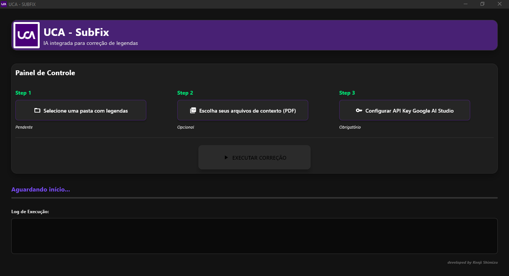

# 🎬 UCA - SubFix (Estúdio de Legendas com IA)


> **UCA - SubFix** é um aplicativo desktop especializado projetado para automatizar a correção de legendas (`.srt` e `.vtt`) para vídeos de treinamento técnico na **Universidade Corporativa Alterdata**.

Combina **IA Generativa (Google Gemini 1.5 Flash)** com **Aplicação de Regras baseadas em Regex** para corrigir erros fonéticos, sotaques específicos do Rio de Janeiro ("Carioca") e terminologia técnica de produtos que ferramentas padrão de ASR (Reconhecimento Automático de Fala) não conseguem capturar.

---

## 📸 Capturas de Tela

<div align="center">
  
  <br>
</div>

---

## 🚀 O Problema que Resolve

Serviços padrão de transcrição (como legendas automáticas do Vimeo ou YouTube) têm dificuldade com:

1.  **Jargão Técnico:** Confundem "Spice Desktop" com "os pais" ou "spi se".
2.  **Nomes de Marcas:** Escrevem "Alter data" em vez de "Alterdata".
3.  **Sotaques Regionais:** Interpretam incorretamente o sotaque "Carioca" (Rio de Janeiro), levando a erros fonéticos graves.
4.  **Contexto:** Não compreendem se "comando" se refere ao verbo ou ao produto "Comanda Mobile".

### 💡 A Solução (Motor Híbrido)
**SubFix resolve isso usando uma abordagem de duas camadas:**
* **Camada 1 (IA):** Usa o Gemini 1.5 para entender o contexto completo da aula, corrigir gramática, pontuação e estrutura das frases.
* **Camada 2 (Código):** Aplica um filtro Regex de "Força Bruta" para garantir 100% de precisão nos nomes dos produtos corporativos.

---

## ✨ Funcionalidades Principais

* **Correção com Consciência Contextual:** Faça upload de manuais em PDF para alimentar a IA com conhecimento específico do domínio antes do processamento.
* **Processamento em Lote Inteligente:** Processa pastas inteiras de legendas automaticamente.
* **Motor de Correção Híbrido:**
    * Corrige nomes específicos de produtos: *Bimer, Pack, Shop, Spice, Comanda*.
    * Corrige vícios comuns de transcrição: *vae -> vai*, *eh -> é*.
* **Interface Moderna:** Construída com **Flet** (Flutter para Python), apresentando uma interface responsiva em Modo Escuro.
* **Segurança:** As Chaves de API são inseridas pelo usuário durante a execução e não são embutidas no código.
* **Executável:** Compilado em um único arquivo portátil `.exe`.

---

## 🛠️ Tecnologias Utilizadas

* **Linguagem:** Python 3.11+
* **Framework de Interface:** [Flet](https://flet.dev/)
* **Modelo de IA:** Google Gemini 1.5 Flash (via `google-generativeai`)
* **Utilitários:** `re` (Regex), `sys`, `os`
* **Ferramenta de Build:** PyInstaller / Flet Pack

---

## 📦 Como Executar (Desenvolvimento)

1.  **Clone o repositório:**
    ```bash
    git clone https://github.com/kenjishimizu2411/UCA_SubFix.git
    cd UCA_SubFix
    ```

2.  **Crie um Ambiente Virtual:**
    ```bash
    python -m venv venv
    
    # Windows
    .\venv\Scripts\activate
    
    # Linux/Mac
    source venv/bin/activate
    ```

3.  **Instale as Dependências:**
    ```bash
    pip install -r requirements.txt
    ```
    *(Nota: Certifique-se de que `flet`, `google-generativeai` e `pyinstaller` estão instalados)*

4.  **Execute o Aplicativo:**
    ```bash
    flet run main.py
    ```

---

## 🏗️ Como Compilar (.EXE)

Para gerar o executável standalone para distribuição no Windows:

1.  Certifique-se de ter a pasta de assets (`assets/`) contendo `logo_uca.ico` e `logo_uca.png`.
2.  Execute o comando de empacotamento (usando Flet Pack para lidar com metadados):

---

## 📝 Guia de Utilização

* **Passo 1:** Selecione a pasta contendo os arquivos .srt ou .vtt originais.
* **Passo 2 (Opcional):** Selecione manuais em PDF para fornecer contexto à IA.
* **Passo 3:** Insira sua Chave de API do Google AI Studio.
* **Passo 4:** Clique em EXECUTAR CORREÇÃO.
* **Passo 5:** Monitore o "Log de Execução". Os arquivos corrigidos serão salvos na mesma pasta com o sufixo _corrigido.

---

<p align="center">
<strong>Desenvolvido para a Universidade Corporativa Alterdata</strong><br>
👤 <strong>Kenji Shimizu</strong><br>
</p>
